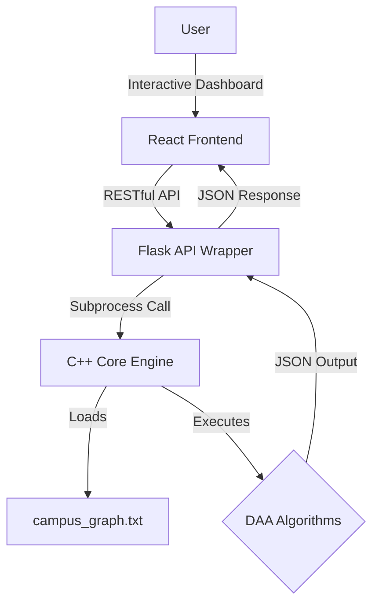

# 📍 CampusRoute — MIT-WPU Smart Navigation System


<div align="center">

[](https://isocpp.org/)
[](https://flask.palletsprojects.com/)
[](https://reactjs.org/)
[](https://opensource.org/licenses/MIT)

**Optimizing campus traversal and infrastructure planning for MIT-WPU Pune using advanced Design and Analysis of Algorithms.**

[Report Bug](https://github.com/pushkar156/Campus-Route/issues) · [Request Feature](https://github.com/pushkar156/Campus-Route/issues)

</div>

---

## 🌟 Overview

**CampusRoute** is more than just a map; it's a high-performance algorithmic suite designed to solve complex spatial and organizational problems within a university ecosystem. Built with a **C++ Core Engine** for heavy computations and a **React-Vite** glassmorphic dashboard for visualization, it provides a premium experience for students and planners alike.

### 🎯 Why CampusRoute?
- **Speed**: Dijkstra-powered pathfinding for the fastest routes.
- **Intelligence**: MST-based cost optimization for cabling/piping infrastructure.
- **Clarity**: BFS/DFS explorations for architectural discovery.
- **Organization**: Topological Sorting for sequential project management.

---

## 🛠️ Key Modules & Algorithms

<details open>
<summary><b>1. 🚀 Pathfinding Engine</b></summary>
Find the optimal walking route between any two major nodes (e.g., Main Gate → Library).
<ul>
  <li><b>Algorithm:</b> Dijkstra's Algorithm (Min-Heap Priority Queue)</li>
  <li><b>Implementation:</b> O((V + E) log V) complexity for real-time responsiveness.</li>
</ul>
</details>

<details>
<summary><b>2. 🌐 Campus Explorer</b></summary>
Visualize node connectivity and facility dependencies.
<ul>
  <li><b>Algorithms:</b> BFS (Layered discovery) & DFS (Deep exploration).</li>
</ul>
</details>

<details>
<summary><b>3. 🏗️ Infrastructure Planner</b></summary>
Minimize the total cost of connecting all facilities with cabling or utilities.
<ul>
  <li><b>Algorithms:</b> Prim's & Kruskal's (Minimum Spanning Tree).</li>
  <li><b>Use Case:</b> Strategic planning for campus-wide infrastructure upgrades.</li>
</ul>
</details>

<details>
<summary><b>4. 🧱 Timeline Management</b></summary>
Generate a dependency-aware construction timeline.
<ul>
  <li><b>Algorithm:</b> Kahn’s Algorithm (Topological Sort).</li>
  <li><b>Logic:</b> Ensures "Wait" conditions are satisfied before starting dependent tasks.</li>
</ul>
</details>

<details>
<summary><b>5. 📑 Smart Directory</b></summary>
O(1) search for location metadata.
<ul>
  <li><b>Data Structures:</b> DJB2 Hashing (Chaining) & AVL Trees for sorted indices.</li>
</ul>
</details>

---

## 📐 System Architecture



---

## 📁 Repository Structure

```bash
Campus-Route/
├── 🧮 cpp/           # Algorithm Engine (Dijkstra, BFS, DFS, MST, AVL)
├── 🐍 backend/       # Python Flask REST API orchestrator
├── ⚛️ frontend/      # Glassmorphic React + Vite Dashboard
└── 📊 data/          # Graph datasets & MIT-WPU spatial metadata
```

---

## 🚦 Getting Started

### 📦 Installation

<details>
<summary><b>Step 1: Core Engine (C++)</b></summary>

```bash
cd cpp
g++ -std=c++17 main.cpp graph.cpp dijkstra.cpp bfs_dfs.cpp mst.cpp topo.cpp avl.cpp hash.cpp -o campus.exe
```
</details>

<details>
<summary><b>Step 2: API Gateway (Flask)</b></summary>

```bash
cd backend
python -m venv .venv
source .venv/bin/activate # Windows: .\.venv\Scripts\activate
pip install -r requirements.txt
python app.py
```
</details>

<details>
<summary><b>Step 3: Visual Dashboard (React)</b></summary>

```bash
cd frontend
npm install
npm run dev
```
</details>

---

## ✍️ Author and Contributors

This project is developed and maintained by:

| Name | GitHub Profile | Role |
| :--- | :--- | :--- |
| **Pushkar** | [](https://github.com/pushkar156) | Developer, Algorithm & Logic Design |
| **Nupur** | [](https://github.com/82nupur) | UI / UX & Documentation |
| **Parth** | [](https://github.com/ParthAgrawal2006) | Architect |

---

## ⚖️ License

Distributed under the MIT License. See `LICENSE` for more information.

<div align="center">
  <sub>Built with ❤️ for the MIT-WPU PBL-2(DAA) Project</sub>
</div>
