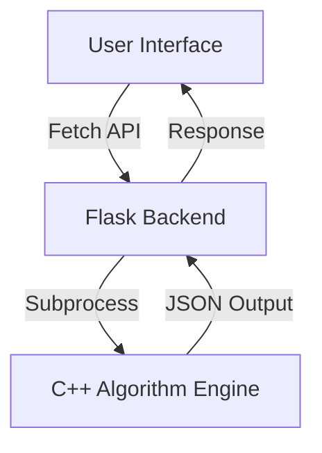

# 📌 CampusRoute — MIT-WPU Smart Campus Navigation & Infrastructure Planning

[](https://github.com/)
[](https://opensource.org/licenses/MIT)

## 📝 Description
**CampusRoute** is an algorithm-driven smart navigation and infrastructure planning system specifically designed for the **MIT-WPU Campus**. It leverages core **Design and Analysis of Algorithms (DAA)** concepts to solve real-world logistical challenges like finding the shortest path between buildings, optimizing cable layout costs, and planning construction sequences.

---

## 🎯 Key Features
- 🚶 **Shortest Path Navigation**: Uses **Dijkstra’s Algorithm** to find the most efficient walking route.
- 🌐 **Campus Exploration**: Implements **BFS & DFS** to visualize connectivity between locations.
- 🏗️ **Infrastructure Planning**: Optimizes costs using **Prim’s & Kruskal’s (MST)**.
- 🧱 **Construction Planning**: Determines task order via **Topological Sort**.
- 🔍 **Instant Search**: High-performance lookup using **Hash Tables**.
- 📑 **Sorted Directory**: Maintains an **AVL Tree** for a balanced, sorted list of facilities.

---

## ⚙️ System Architecture
The system follows a three-tier architecture for modularity and performance:

1.  **Frontend**: HTML5, CSS3 (Vanilla), and JavaScript for a premium, responsive UI.
2.  **Backend**: Python (Flask) acting as a lightweight middleware.
3.  **Engine**: High-performance C++ implementation of DAA algorithms.



---

## 🛠️ Tech Stack
- **Algorithms**: C++
- **Web Middleware**: Python (Flask)
- **UI/UX**: HTML, CSS, JavaScript (Vanilla)
- **Data Exchange**: JSON
- **Data Structures**: Weighted Graphs, Priority Queues, AVL Trees, Hash Tables.

---

## 🚀 Installation & Setup
1.  **Clone the repository**:
    ```bash
    git clone https://github.com/your-username/CampusRoute.git
    cd CampusRoute
    ```
2.  **Compile the C++ Engine**:
    ```bash
    cd cpp
    g++ main.cpp -o campus.exe
    ```
3.  **Install Python Dependencies**:
    ```bash
    cd ../backend
    pip install -r requirements.txt
    ```
4.  **Run the Application**:
    ```bash
    python app.py
    ```
5.  Access the UI at `http://127.0.0.1:5000`.

---

## 📚 DAA Concepts Mapping
| Unit | Concept | Application in CampusRoute |
|---|---|---|
| I | Time Complexity | Optimized searching and sorting efficiency. |
| II | Graphs | Dijkstra, BFS, DFS, MST, Topological Sort. |
| III | Balanced Trees | AVL Trees for location directory management. |
| IV | Backtracking | 8 Queen Problem (Advanced Demo). |
| V | Hashing | Hash Table for O(1) location lookup. |

---

## 📂 Project Structure
```text
CampusRoute/
├── backend/      # Flask API logic
├── cpp/          # C++ DAA implementations
├── frontend/     # HTML/CSS/JS web files
├── data/         # Campus graph data (txt/json)
└── README.md
```

---

## 🤝 Contributing
Contributions are welcome! Please fork the repository and create a pull request with your changes.

## 📄 License
This project is licensed under the MIT License - see the [LICENSE](LICENSE) file for details.
